# GitHub Actions + Docker + Nginx Demo

[](https://github.com/zerx-lab/github-copilot-learn/actions/workflows/docker-publish.yml)
[](https://github.com/zerx-lab/github-copilot-learn/actions/workflows/copilot-auto-assign.yml)

一个学习 GitHub Actions 的练习项目，演示如何：
1. 在提交代码到 main 分支时自动构建 Docker 镜像并推送到 GitHub Packages
2. 自动将带有 `copilot` 标签的 Issue 分配给 GitHub Copilot coding agent
3. 通过 SSH 自动部署到远程服务器

## 目录

- [项目结构](#项目结构)
- [核心功能](#核心功能)
- [前置要求](#前置要求)
- [快速开始](#快速开始)
- [工作原理](#工作原理)
- [Copilot 自动分配功能](#copilot-自动分配功能)
- [服务器部署配置](#服务器部署配置)
- [常见问题](#常见问题)
- [贡献](#贡献)
- [许可证](#许可证)

## 项目结构

```
.
├── .github/workflows/
│   ├── copilot-auto-assign.yml  # Copilot 自动分配工作流
│   └── docker-publish.yml       # Docker 构建和部署工作流
├── public/
│   └── index.html               # 前端页面
├── Dockerfile                   # Docker 构建文件
├── nginx.conf                   # Nginx 配置
└── README.md
```

## 核心功能

### 🚀 自动化 CI/CD
- **自动构建**：代码推送到 `main` 分支时，自动触发 Docker 镜像构建
- **容器化部署**：基于 Nginx Alpine 镜像，轻量高效
- **镜像管理**：自动推送到 GitHub Container Registry (ghcr.io)
- **自动部署**：构建完成后自动部署到远程服务器

### 🤖 Copilot 集成
- **智能分配**：自动将 Issue 分配给 GitHub Copilot coding agent
- **自动化处理**：Copilot 自动创建分支并开始处理任务
- **无缝协作**：通过标签快速触发 AI 辅助开发

## 前置要求

在使用本项目之前，请确保你已经安装以下工具：

- **Git** - 版本控制系统
- **Docker** - 容器化平台（本地测试需要）
  ```bash
  docker --version  # 验证安装
  ```
- **GitHub 账号** - 用于 Actions 和 Packages
- **SSH 密钥对** - 用于服务器部署（可选）

## 快速开始

### 1. Fork 或克隆仓库

```bash
# 克隆仓库
git clone https://github.com/zerx-lab/github-copilot-learn.git
cd github-copilot-learn
```

### 2. 本地测试

```bash
# 构建镜像
docker build -t hello-nginx .

# 运行容器
docker run -p 8080:80 hello-nginx

# 访问 http://localhost:8080
```

### 3. 配置 GitHub Actions

1. **启用 Actions 权限**（默认已启用）：
   - 进入仓库 Settings → Actions → General
   - 确保 "Read and write permissions" 已启用

2. **配置 Copilot**（可选）：
   - 在仓库设置中启用 GitHub Copilot
   - 添加 `COPILOT_PAT` Secret（见下方详细说明）

3. **配置部署**（可选）：
   - 添加 `SSH_PRIVATE_KEY` Secret
   - 修改 `docker-publish.yml` 中的服务器地址

### 4. 推送代码触发自动部署

```bash
git add .
git commit -m "Your commit message"
git push origin main
```

GitHub Actions 将自动：
1. 构建 Docker 镜像
2. 推送到 GitHub Packages
3. 部署到远程服务器（如已配置）

## 工作原理

### Docker 镜像构建和推送流程

```mermaid
graph LR
    A[推送到 main] --> B[触发 GitHub Actions]
    B --> C[构建 Docker 镜像]
    C --> D[登录 ghcr.io]
    D --> E[推送镜像]
    E --> F[SSH 连接服务器]
    F --> G[拉取并运行镜像]
```



1. 当代码推送到 `main` 分支时，GitHub Actions 自动触发
2. 工作流登录到 GitHub Container Registry (ghcr.io)
3. 构建 Docker 镜像（基于 nginx:alpine）
4. 推送镜像到 GitHub Packages，标签包括：
   - `latest` - 最新的 main 分支版本
   - `<commit-sha>` - 特定提交的版本
5. 通过 SSH 连接远程服务器
6. 拉取最新镜像并重启容器

## Copilot 自动分配功能

本项目配置了 GitHub Actions 工作流，可以自动将 Issue 分配给 GitHub Copilot coding agent。

### 使用方法

1. **创建或打开一个 Issue**
2. **添加标签 `copilot`** 到该 Issue
3. GitHub Actions 会自动触发，将该 Issue 分配给 Copilot coding agent
4. Copilot 会自动开始处理该 Issue

### 配置要求

- 需要在仓库设置中启用 GitHub Copilot coding agent
- 需要配置 Personal Access Token (PAT) 作为仓库 Secret：
  - 进入 GitHub 仓库 → Settings → Secrets and variables → Actions
  - 点击 "New repository secret"
  - Name: `COPILOT_PAT`
  - Value: 具有 `repo` 权限的 Personal Access Token

### 工作流程

1. 当 Issue 被添加 `copilot` 标签时，工作流自动触发
2. 通过 GraphQL API 获取 Copilot bot ID 和仓库信息
3. 使用 GraphQL mutation 将 Issue 分配给 Copilot coding agent
4. Copilot 自动创建分支并开始处理 Issue

## 服务器部署配置

工作流会自动将镜像部署到服务器 `40.81.208.36`，部署目录为 `/home/zero/learn`。

### 配置 SSH 秘钥

1. **在本地生成 SSH 密钥对**（如果没有的话）：
   ```bash
   ssh-keygen -t rsa -C "github-actions-deploy"
   ```
   按提示操作，建议不设置密码以便自动化部署。
 
2. **将公钥添加到服务器**：
   ```bash
   # 复制公钥内容
   cat ~/.ssh/id_github_actions.pub

   # 登录服务器，将公钥添加到 authorized_keys
   ssh zero@40.81.208.36
   echo "公钥内容" >> ~/.ssh/authorized_keys
   ```

   或使用 ssh-copy-id：
   ```bash
   ssh-copy-id -i ~/.ssh/id_github_actions.pub zero@40.81.208.36
   ```

3. **将私钥添加到 GitHub Secrets**：
   - 进入 GitHub 仓库 → Settings → Secrets and variables → Actions
   - 点击 "New repository secret"
   - Name: `SSH_PRIVATE_KEY`
   - Value: 粘贴私钥内容（包括 `-----BEGIN` 和 `-----END` 行）
   ```bash
   # 查看私钥内容
   cat ~/.ssh/id_github_actions
   ```

4. **确保服务器已安装 Docker**：
   ```bash
   # 在服务器上检查 Docker
   docker --version

   # 如未安装，参考 Docker 官方文档安装
   ```

### 部署流程

1. 推送代码到 `main` 分支
2. GitHub Actions 自动构建并推送 Docker 镜像
3. 通过 SSH 连接服务器，拉取最新镜像并重启容器

## 拉取已发布的镜像

如果你想直接使用已发布的镜像：

```bash
# 拉取最新镜像
docker pull ghcr.io/zerx-lab/github-copilot-learn:latest

# 运行容器
docker run -p 8080:80 ghcr.io/zerx-lab/github-copilot-learn:latest
```

**注意**：镜像需要 GitHub 登录认证（如果仓库是私有的）：

```bash
# 使用 GitHub PAT 登录
echo $GITHUB_TOKEN | docker login ghcr.io -u USERNAME --password-stdin
```

## 常见问题

### 1. 如何查看构建状态？

访问仓库的 [Actions 页面](https://github.com/zerx-lab/github-copilot-learn/actions) 查看工作流运行状态。

### 2. 为什么镜像推送失败？

确保仓库已启用以下权限：
- **Actions** - 读写权限（Settings → Actions → General → Workflow permissions）
- **Packages** - 读写权限（默认启用）

### 3. SSH 部署失败怎么办？

检查以下事项：
- ✅ SSH 私钥是否正确添加到 Secrets
- ✅ 服务器 IP 和用户名是否正确
- ✅ 服务器是否已添加对应的公钥到 `~/.ssh/authorized_keys`
- ✅ 服务器是否已安装 Docker

### 4. Copilot 自动分配不工作？

确认：
- ✅ 仓库已启用 GitHub Copilot
- ✅ `COPILOT_PAT` Secret 已正确配置
- ✅ PAT 具有 `repo` 和 `workflow` 权限
- ✅ Issue 是否打开（opened）时触发，而非添加标签时

### 5. 如何修改部署服务器地址？

编辑 `.github/workflows/docker-publish.yml` 文件中的 `deploy` job：

```yaml
with:
  host: 你的服务器IP
  username: 你的用户名
  key: ${{ secrets.SSH_PRIVATE_KEY }}
```

### 6. 如何自定义镜像名称？

修改 `.github/workflows/docker-publish.yml` 中的 `IMAGE_NAME` 环境变量。

## 贡献

欢迎贡献！如果你有任何改进建议或发现了 bug：

1. Fork 本仓库
2. 创建你的特性分支 (`git checkout -b feature/AmazingFeature`)
3. 提交你的更改 (`git commit -m 'Add some AmazingFeature'`)
4. 推送到分支 (`git push origin feature/AmazingFeature`)
5. 开启一个 Pull Request

或者直接创建一个 [Issue](https://github.com/zerx-lab/github-copilot-learn/issues/new) 来讨论你的想法。

## 许可证

本项目采用 MIT 许可证 - 查看 [LICENSE](LICENSE) 文件了解详情。

---

**学习资源**：
- [GitHub Actions 文档](https://docs.github.com/en/actions)
- [Docker 官方文档](https://docs.docker.com/)
- [Nginx 文档](https://nginx.org/en/docs/)
- [GitHub Copilot 文档](https://docs.github.com/en/copilot)

**示例演示**：访问 http://40.81.208.36:2222 查看部署的演示应用（如果服务器在线）。
